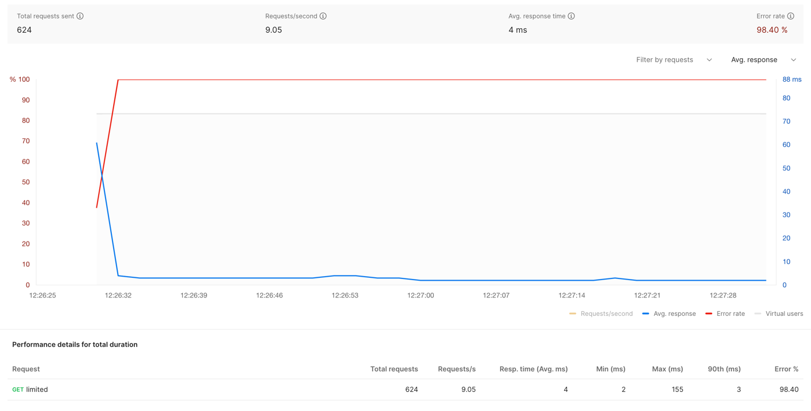
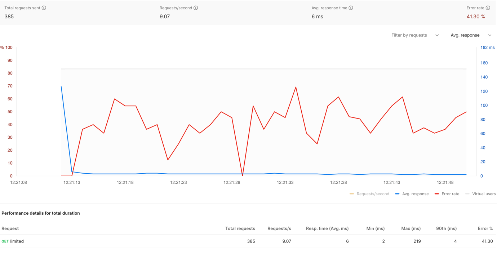
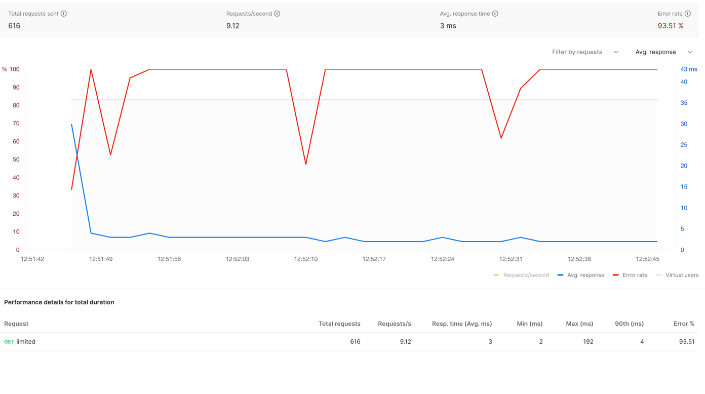
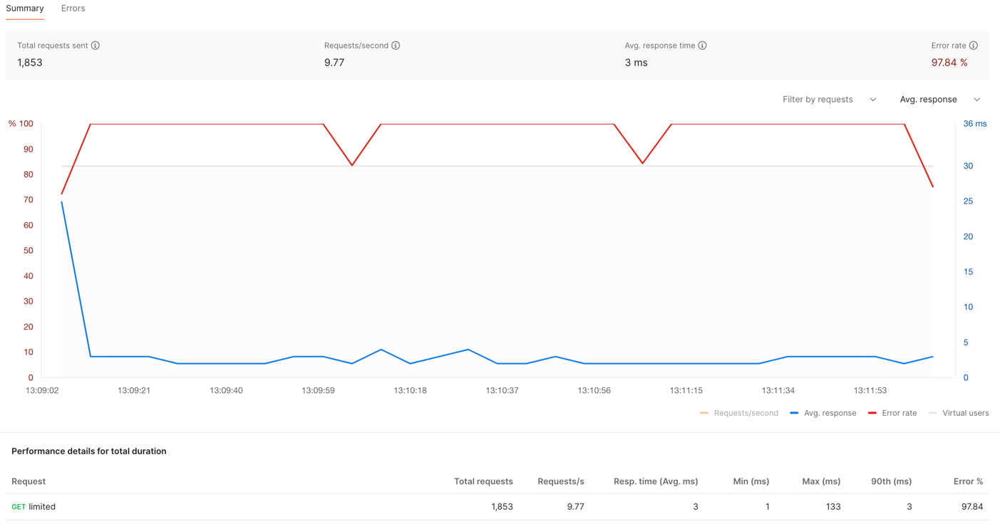
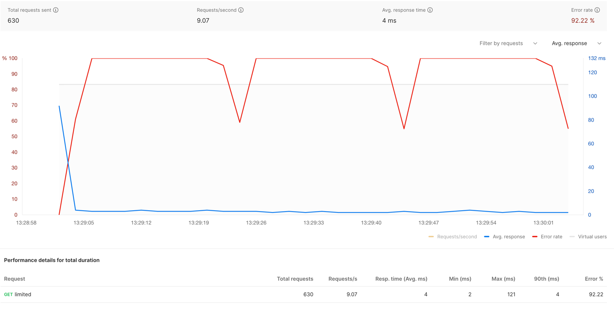
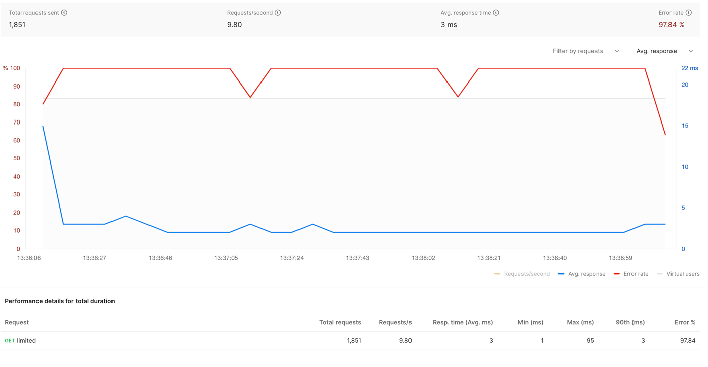

# Rate limiter

## Overview

This document outlines the design and implementation details of a Rate Limiter system, which is essential for throttling
traffic in an API or large-scale distributed system. Rate limiting strategies help ensure the stability and reliability
of the system by preventing abuse, accidental overload, or deliberate attacks.

## Goals

- Implement various rate limiting algorithms: Token Bucket, Fixed Window Counter, and Sliding Window Counter.
- Enable rate limiting across multiple servers using Redis for shared state.
- Design and implement a scalable solution capable of handling bursts of traffic and distributed systems.

## REST APIs

- **Unlimited request**
  - GET
  - Endpoint: `/unlimited`
  - Request Header: ``` ```
  - Request Body:
    ```
      Unlimited! Let's Go!
    ```

- **Limit request**
  - GET
  - Endpoint: `/limit`
  - Request Header: ``` ```
  - Request Body:  
    ```
      Limited, don't over use me!
    ```
    or
    ```
      Request is dropped
    ```

## Postman configurations

Load profile = Fixed \
Virtual users = 10 \
Test duration = 1 min

## Token Bucket Algorithm

### Description
Tokens are added to a bucket at a fixed rate. Each request consumes tokens from the bucket. If there are
  no tokens available, the request is rejected.

### Implementation
Bucket per IP address with a capacity of 10 tokens and a refill rate of 1 token per second.

### Experiment results 
Refill rate = 1 \
Bucket size = 10


Refill rate = 10 \
Bucket size = 10


## Fixed Counter Window Algorithm

### Description
Requests are tracked within fixed time windows. If the number of requests exceeds a threshold within a window, subsequent requests are rejected.

### Implementation
Windows defined by the floor of the current timestamp, with a configurable window size (e.g., 60 seconds) and request threshold (e.g., 60 requests).

### Experiment results

Window size = 20 \
Bucket size = 10


Window size = 60 \
Bucket size = 10


## Sliding Window Log Algorithm

### Description
Hybrid approach combining the low processing cost of the fixed window algorithm and improved boundary conditions of the sliding log algorithm.

### Implementation
Maintain counters for current and previous fixed windows. Use a weighted count of current and previous windows to determine the sliding window count.

### Experiment results

Window size = 20 \
Bucket size = 10


Window size = 60 \
Bucket size = 10

 
## Future Task
- Adding Sliding window counter algorithm.